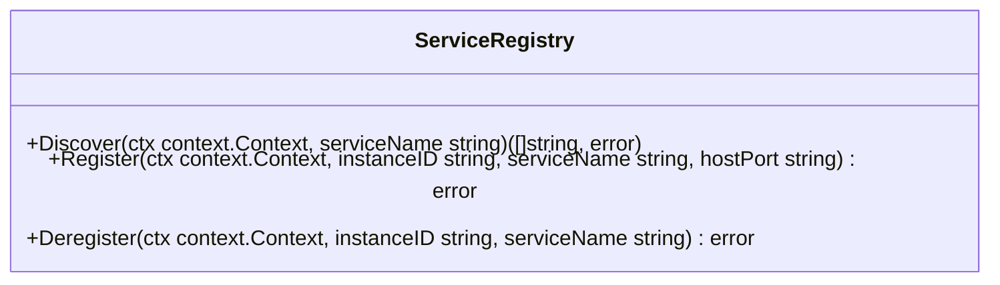

# Storage
Вы решили создать конкурента Amazon S3 и знаете как сделать лучший сервис
хранения файлов.
- На сервер A по REST присылают файл, его надо разрезать на 6 примерно равных частей и сохранить на серверах хранения Bn (n ≥ 6).
- При REST-запросе на сервер A нужно достать куски с серверов Bn склеить их и отдать
файл.
---
Условия:
- Один сервер для REST запросов
- Несколько серверов для хранения кусков файлов
- Файлы могут достигать размера 10 GiB
---
Ограничения:
- Реализовать тестовый модуль для сервиса, который обеспечит проверку его
функционала, продемонстрирует загрузку и чтение файла.
- Сервера для хранения могут добавляться в систему в любой момент, но не могут удаляться из системы.
- Предусмотреть равномерное заполнение серверов хранения.
- Необходимо учесть различные сценарии, например, пользователь ушел во
время загрузки.
- Сервера хранения должны быть отдельными приложениями.
- Протокол общения REST сервера с серверами хранения нужно выбрать самостоятельно.
- Написать docker-compose для поднятия сервиса.
___


___
debug with [dev stats](https://github.com/variegate-app/dev-stats)

---
start development application in docker
```sh
make start-docker-dev
```

build application in ./.bin folder
```sh
make build-app app=discovery
```

test application
```sh
make test
```